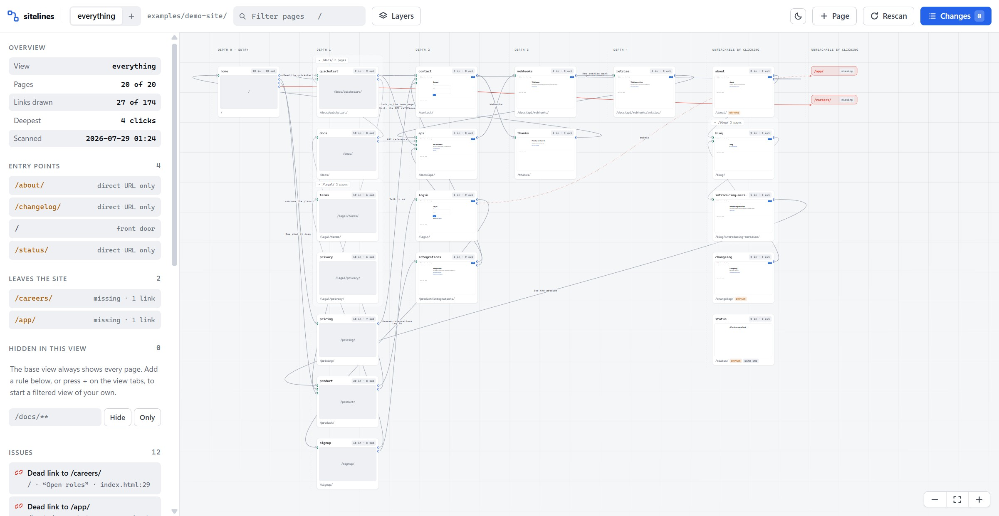
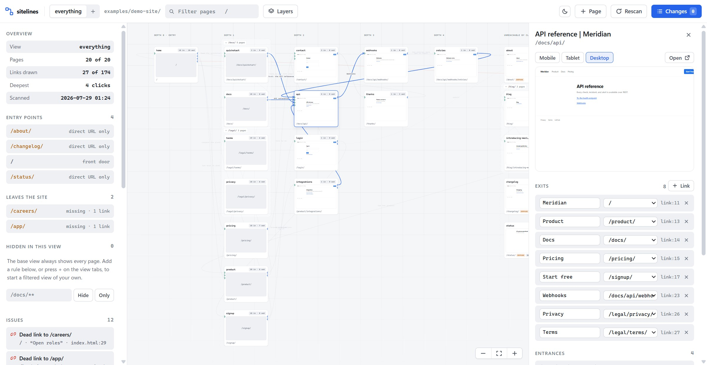
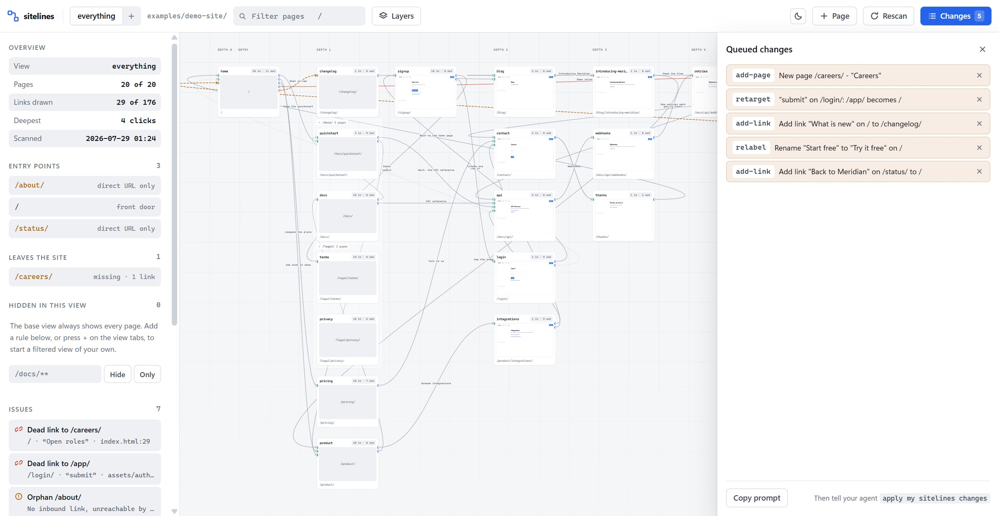
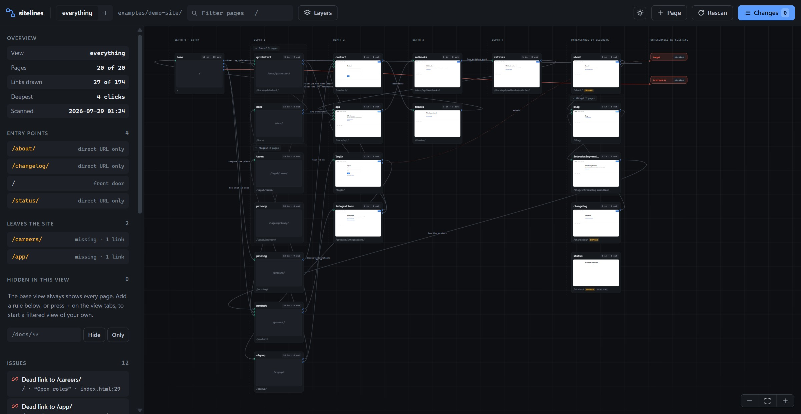

<div align="center">

# sitelines

**See every page on your site, every link between them, and everything that is broken.**

Zero dependencies · no build step · Node 18+ · MIT

</div>



sitelines reads your source, finds every page and every link, button, redirect, and form that moves between
them, then serves a map in your browser. Each card is a real page with a live preview. Each wire is a real
control, labelled with its actual button text and traced back to `file:line`.

It tells you what is wrong: links that go nowhere, pages nothing links to, pages with no way out, pages
buried more than three clicks deep, and pages carrying too many exits.

You can also change the navigation from the map. Rename a button, point it somewhere else, draw a new link
between two pages, propose a new page. **Nothing is written to your site.** Changes queue to a JSON file,
and a coding agent implements them in your code when you ask.

> The screenshots on this page are the bundled example site, mapped by sitelines itself. Run
> `npx sitelines demo` and you get exactly this.

---

## How to use it

**1. Point it at your pages.**

```bash
cd your-project
npx sitelines open
```

That scans, starts a local server, and opens `http://localhost:4370`. It looks for your pages in `public`,
`site`, `www`, `static`, `src/pages`, `src/routes`, `src/app`, `app/pages`, `pages`, `app`, or `docs`.
Point it somewhere else with `--root`:

```bash
npx sitelines open --root src/routes --port 5000
```

**2. Read the map.** Columns are click depth from your front door. Cards are pages. Wires are controls. The
left sidebar counts what exists and lists what is broken, and every issue jumps you to the page it is on.

**3. Change the navigation.** Edit an exit's text, change where it points, draw a new link, propose a page.
Everything you do queues up instead of touching your files.

**4. Hand the queue to an agent.** Press **Copy prompt**, or install the skill and say
*"apply my sitelines changes"*.

---

## Install

Three ways in, depending on what you want.

### Option 1: the tool

Everything above. The scanner, the server, and the map.

```bash
npx sitelines open                     # no install
npm install -g sitelines               # or keep it around
pnpm add -g sitelines
```

Or from source, with nothing to build:

```bash
git clone https://github.com/Jkaos725/sitelines.git
cd your-project
node /path/to/sitelines/bin/sitelines.mjs open
```

### Option 2: the demo

See what it does before pointing it at anything of yours. This copies a 20-page example site into
`./sitelines-demo` and maps it. Nothing outside that folder is touched.

```bash
npx sitelines demo
```

The example has deliberate faults so every part of the map has something to show: two dead links (one of
them only reachable by reading the JavaScript), three orphans, a dead end, and a page four clicks deep.

### Option 3: the Claude Code skill

The same tool, plus the instructions an agent needs to turn your queued changes into real code. This is the
only option that can actually **write** the changes for you.

**Claude Code** reads skill folders:

```bash
npx sitelines skill install            # ~/.claude/skills/sitelines    (every project)
npx sitelines skill install --project  # ./.claude/skills/sitelines    (this repo only)
```

**Codex, opencode, Cursor, Zed, Gemini CLI** read `AGENTS.md` from your project root:

```bash
npx sitelines agents install            # writes the block into ./AGENTS.md
npx sitelines agents uninstall          # takes it back out
```

That appends a fenced block rather than overwriting, so an existing `AGENTS.md` keeps everything it
already had. Re-running replaces the block in place instead of duplicating it, and uninstalling leaves
your own content untouched.

<details>
<summary>Install it by hand instead</summary>

A Claude Code skill is just a folder containing a `SKILL.md`. Copy four things into it:

```bash
git clone https://github.com/Jkaos725/sitelines.git
mkdir -p ~/.claude/skills/sitelines

cp    sitelines/skill/SKILL.md   ~/.claude/skills/sitelines/
cp -r sitelines/skill/references ~/.claude/skills/sitelines/
cp -r sitelines/scripts          ~/.claude/skills/sitelines/
cp -r sitelines/viewer           ~/.claude/skills/sitelines/
```

On Windows PowerShell:

```powershell
git clone https://github.com/Jkaos725/sitelines.git
New-Item -ItemType Directory -Force "$HOME\.claude\skills\sitelines"

Copy-Item sitelines\skill\SKILL.md   "$HOME\.claude\skills\sitelines\"
Copy-Item sitelines\skill\references "$HOME\.claude\skills\sitelines\" -Recurse
Copy-Item sitelines\scripts          "$HOME\.claude\skills\sitelines\" -Recurse
Copy-Item sitelines\viewer           "$HOME\.claude\skills\sitelines\" -Recurse
```

</details>

<details>
<summary>Or ask Claude Code to install it</summary>

Paste this in:

> Install the sitelines skill from https://github.com/Jkaos725/sitelines into `~/.claude/skills/sitelines`.
> Clone the repo to a temp directory, copy `skill/SKILL.md`, `skill/references/`, `scripts/`, and `viewer/`
> into the skill folder, then confirm `~/.claude/skills/sitelines/SKILL.md` exists.

</details>

Restart Claude Code, then type `/sitelines` or just ask:

- "show me the site flow"
- "where does the Start free button go?"
- "find the dead links"
- "apply my sitelines changes"

### All commands

```
sitelines scan  [--root DIR] [--out DIR]                       read the site, write .sitelines/flow.json
sitelines serve [--root DIR] [--out DIR] [--port N] [--open]   open the map
sitelines open  [--root DIR] [--port N]                        scan, serve, and open the browser
sitelines demo  [--dir DIR] [--port N]                         copy the example site and map it
sitelines skill install   [--global|--project] [--force]       install the Claude Code skill
sitelines skill uninstall [--global|--project]                 remove it
sitelines agents install   [--dir DIR]                         write the AGENTS.md block (every other agent)
sitelines agents uninstall [--dir DIR]                         remove just that block
sitelines version
sitelines help
```

---

## Features

### It hides your header and footer, and says so

A nav bar repeated on twenty pages emits twenty identical links, and those wires bury every link that is
actually specific to a page. sitelines detects any link appearing on more than four pages, folds it away,
and reports the count it folded: **27 of 174** in the screenshot above. Turn it back on under **Layers**.

Folding is a drawing decision, never an analytical one. A page reachable only through your footer is still
reachable, and sitelines will not call it an orphan just because the footer is hidden.

### Every page is live, at any width



Click a card to open it: a real preview at mobile, tablet, or desktop width, every exit with its editable
label and destination, every entrance, and a notes field. Previews come straight off disk, so you do not
need a dev server running.

The dots down each side of a card are ports, and each wire terminates on the exact dot that represents it.
Hover any dot or wire for the control's real text, both routes, how it navigates, and its `file:line`.

### Changes queue instead of landing



| Do this | Get this |
| --- | --- |
| Edit an exit's text field | A queued rename |
| Change an exit's destination | A queued retarget |
| Click the ✕ on an exit | A queued removal |
| **+ Link**, then click a destination | A queued new control |
| **+ Page** | A queued new page, optionally linked from the selected one |

The map previews the result immediately: queued links draw in amber, and a proposed page appears as a
dashed card. The queue lives in `.sitelines/edits.json` and is the only thing sitelines writes.

### Both themes, because it sits next to your editor



Follows `prefers-color-scheme` and remembers a manual override. Every text color clears WCAG AA in both.

### Views are yours to define

The base view, **everything**, always shows every page and never takes a rule. Filter from it and sitelines
starts a new view rather than quietly turning your one complete picture into a partial one. Press **+** on
the tab bar to name a view, or write one into `.sitelines/views.json` and it appears:

```json
{
  "active": "all",
  "views": [
    { "id": "all",  "label": "everything", "base": true, "include": [], "exclude": [] },
    { "id": "docs", "label": "docs only",  "include": ["/docs/**"], "exclude": [] },
    { "id": "app",  "label": "no legal",   "include": [], "exclude": ["/legal/**"] }
  ]
}
```

Patterns: `/docs/**` (subtree), `/docs/` (exact), `/docs/*` (one level), `*report*` (substring).

### Directories collapse

Pages sharing a top-level directory sit on a labelled backdrop. Click the label to fold the whole directory
into one card: internal links disappear, and the directory keeps one wire per neighbour labelled `N links`,
with every underlying control in its tooltip.

### Keyboard

| | |
| --- | --- |
| Drag background / wheel | Pan / zoom |
| `f` | Fit everything on screen |
| `/` | Focus the filter |
| `1` `2` `3` | Switch views |
| `e` | New link from the selected page |
| `Escape` | Cancel whatever is in progress |

---

## What the scanner reads

| Source | How the label is found |
| --- | --- |
| `<a href>` | The link text |
| `<button>` / `<div>` with `onclick="location.href=…"`, `data-href`, `data-nav`, `formaction` | The element text |
| `<form action>` | `POST form` |
| `<meta http-equiv=refresh>` | `meta refresh` |
| `location.href` / `.assign` / `.replace`, `window.open`, `router.push` / `.replace`, `navigate()` | The nearest `getElementById` or `querySelector` above the call |

Pages are `*.html` files. If a project has none, sitelines falls back to framework page files under
`pages/`, `routes/`, or `app/`.

It is static analysis, so it reads what is in the source. A destination assembled at runtime from a template
string is not something a scanner can resolve, and sitelines skips it rather than guessing.

## Previews

Two defaults worth knowing:

- **Page JavaScript is off.** Preview iframes get an empty `sandbox`. A page that polls or retries a dead
  API will otherwise peg your browser forty iframes over. Markup and CSS still render. Turn it on under
  **Layers → Run page JavaScript**.
- **Service workers are blocked** inside previews, or your site's own worker caches the preview responses
  and serves them back for every later preview.

For pages that need real data or a login, run your own dev server and use the **Open** button on the card.

## Performance

Large sites stay usable because the viewer refuses to pretend:

- At most 12 preview iframes stay mounted, two loading at a time. Offscreen cards unmount.
- Past 60 pages previews start off, and the viewer says why.
- Below 0.26 zoom, thumbnails and wire labels leave the render tree instead of compositing a smear.

## State

sitelines writes one directory next to where you run it:

```
.sitelines/
├── flow.json     the scan: pages, links, issues, plus your card positions and notes
├── views.json    your views and their rules
└── edits.json    the change queue, including applied history
```

Add it to `.gitignore` if it is yours alone, or commit it to share the layout and notes with your team.
Nothing outside this directory is ever written.

---

## Contributing

Issues and pull requests are welcome.

- **No dependencies.** Everything is Node's standard library and platform web APIs. A PR adding a runtime
  dependency needs a strong reason.
- **No build step.** `viewer/` is HTML, CSS, and ES modules served as written.
- **Read `DESIGN.md` before touching `viewer/style.css`.** It is the authority on tokens, shape, type,
  motion, and what each color means.
- Test against `examples/demo-site` and against something with more than 40 pages. Density is where this
  tool succeeds or fails.

## License

MIT. See [LICENSE](LICENSE).
